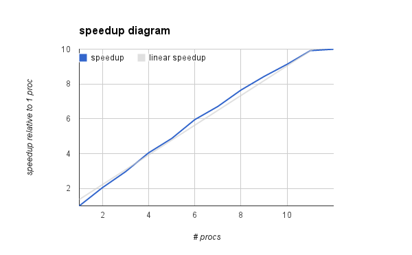

# Optimierung

**Sequentiell, ohne `-fopenmp`:**

`./partdiff-seq 1 2 512 2 2 200` braucht **120.29s**.

**1 Thread, mit `-fopenmp`:**

`./partdiff-seq 1 2 512 2 2 200` braucht **120.65s**.

**12 Threads, mit `-fopenmp`:**

`./partdiff-seq 1 2 512 2 2 200` braucht **14.9s**.

**Mit verschiedenen Schedulings, jw 12 Threads:**

- **`schedule(dynamic, 1)`:**
    - `./partdiff-seq 1 2 512 2 2 200` braucht **11.39s**.
    - Speedup zu ohne OMP: **10.59**. The winner! :)

- **`schedule(dynamic, 4)`:**
    - `./partdiff-seq 1 2 512 2 2 200` braucht **14.2s**.
    - Speedup zu ohne OMP: **~8.5**.

- **`schedule(guided)`:**
    - `./partdiff-seq 1 2 512 2 2 200` braucht **12.3s**.
    - Speedup zu ohne OMP: **9.8**.

- **`schedule(static, 1)`:**
    - `./partdiff-seq 1 2 512 2 2 200` braucht **14.1s**.

- **`schedule(static, 2)`:**
    - `./partdiff-seq 1 2 512 2 2 200` braucht **14.7s**.

- **`schedule(static, 16)`:**
    - `./partdiff-seq 1 2 512 2 2 200` braucht **14.57s**.

Zeit benötigt: 2h. Fehlersuche? Ja, zuerst haben wir die simple interference function geenommen und dadurch nur ein Speedup von 4 erreicht.

# Messungen

## Messung 1

procs       speedup         time in sec
-------     -------         -----------
1 (no OMP)  1        		120.29
1	     	1		        120.65
2	     	2.044222298		59.02
3	     	2.960009814		40.76
4	     	4.045942321		29.82
5	     	4.868845843		24.78
6	     	5.952146029		20.27
7	     	6.710233593		17.98
8	     	7.65060241		15.77
9	     	8.431167016		14.31
10	     	9.1332324		13.21
11	     	9.913722268		12.17
12	     	9.995857498		12.07

